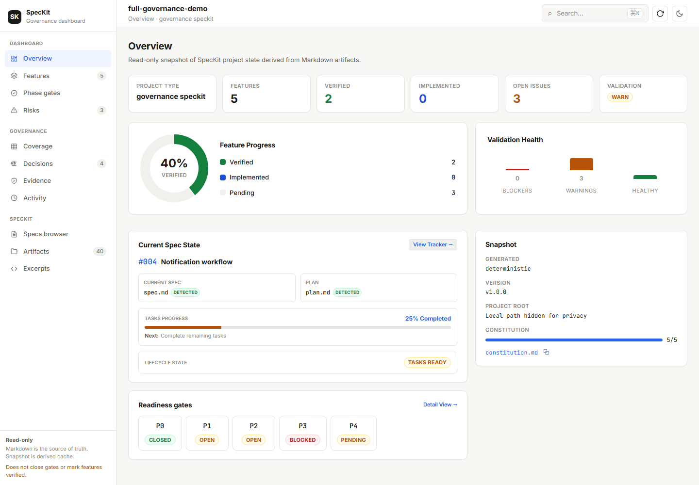
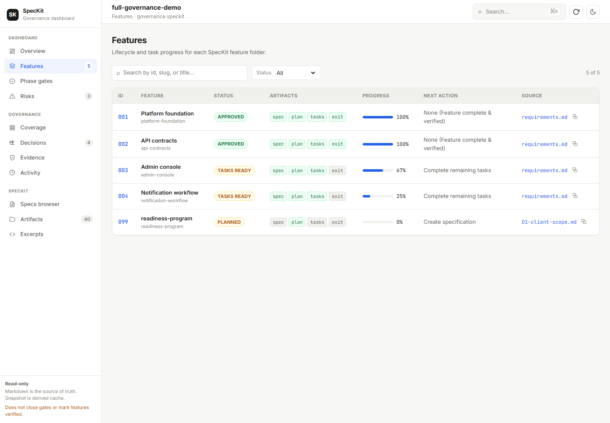
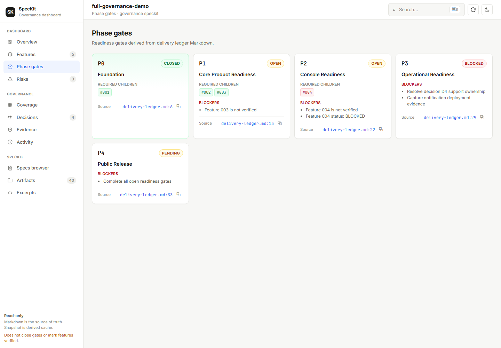

# SpecKit Governance Dashboard

> A read-only, Markdown-first visual dashboard for SpecKit projects.

**npm package:** `speckit-governance-dashboard`

**Project docs:** [skgd.itseslam.com](https://skgd.itseslam.com) · **Author:** [Eslam M. Mohamed](https://itseslam.com)

[](https://github.com/essov3/speckit-governance-dashboard/actions/workflows/ci.yml) [](LICENSE)

## Demo screenshots

The images below are generated exclusively from the synthetic full-governance demo. They are safe to publish and illustrate the dashboard’s read-only views.





SpecKit Governance Dashboard scans SpecKit Markdown artifacts, contracts, tasks, checklists, evidence, and optional governance ledgers from an external project path, then generates a deterministic read-only snapshot and visual UI.

It is designed for repositories created with or compatible with [GitHub Spec Kit](https://github.com/github/spec-kit). This dashboard is an independent companion project and is not an official GitHub or Spec Kit project.

**Markdown remains the source of truth. Generated JSON is derived cache only. The dashboard never writes lifecycle state. The dashboard does not modify the target SpecKit project.**

This project is an independent companion dashboard for SpecKit-style repositories. It is not an official GitHub project.

## What it is—and is not

It is a local artifact discovery, validation, snapshot, and visualization tool. It is not a project-management backend, database, workflow engine, Markdown editor, or lifecycle mutation tool.

## Features

- Read-only external-project scanning with pre/post mutation protection
- Vanilla SpecKit artifact discovery plus optional governance artifacts
- Deterministic JSON snapshots for repeatable CI checks
- Live source watching with debounced regeneration and in-place browser refresh
- Visual UI for overview, features, gates, evidence, decisions, coverage, diagnostics, and artifact inventory
- Contract, checklist, evidence, phase-exit, ledger, and decision detection
- Adapter-based parsing architecture with no default customer-specific rules

Supported artifacts include `.specify/feature.json`, constitutions, `spec.md`, `plan.md`, `tasks.md`, checklists, contracts, evidence, phase exits, decision records, delivery ledgers, and coverage matrices.

## Quick start

The fastest way to use the dashboard is directly via npm.

### From npm (Recommended)

Run it without a global installation:

```bash
npx speckit-governance-dashboard doctor --project-root ../my-speckit-project
npx speckit-governance-dashboard generate --project-root ../my-speckit-project --deterministic
npx speckit-governance-dashboard watch --project-root ../my-speckit-project
```

Or install it globally for everyday use (both the full command and the shorter `speckit-dashboard` alias are available):

```bash
npm install --global speckit-governance-dashboard
speckit-dashboard doctor --project-root ../my-speckit-project
speckit-governance-dashboard generate --project-root ../my-speckit-project --deterministic
```

`--project-root` must point to the local SpecKit project you want to inspect. The CLI reads that project without modifying its Markdown artifacts or lifecycle state.

### From a clone (For development/demos)

If you want to run the dashboard with the synthetic demo examples or develop the project, clone the repository:

```bash
git clone https://github.com/essov3/speckit-governance-dashboard.git
cd speckit-governance-dashboard
npm install
npm run build
npm run dashboard:doctor -- --project-root ./examples/vanilla-speckit-demo
npm run dashboard:generate -- --project-root ./examples/vanilla-speckit-demo --deterministic
npm run dashboard:watch -- --project-root ./examples/vanilla-speckit-demo
```

`--project-root` is the SpecKit project being analyzed, not the dashboard repository. For another local project:

```bash
npm run dashboard:generate -- --project-root ../my-speckit-project
```

The commands above assume a cloned checkout, which includes the synthetic examples. The published npm package intentionally contains only the runtime files, not `examples/`.

## CLI

After a global install (or through `npx speckit-governance-dashboard <command>`), the CLI is available as `speckit-governance-dashboard` and the shorter alias `speckit-dashboard`. Both expose the same five commands:

```bash
speckit-dashboard doctor   --project-root <project>                  # structure and file-health report
speckit-dashboard generate --project-root <project> --deterministic  # write the snapshot JSON cache
speckit-dashboard check    --project-root <project> --deterministic  # validate and detect stale snapshots
speckit-dashboard serve    --project-root <project>                  # dashboard UI with live updates
speckit-dashboard watch    --project-root <project>                  # explicit live mode (alias of serve)
```

From a cloned repository the same commands run through npm scripts with the `dashboard:` prefix (note the `--` separating npm's arguments from the CLI's):

```bash
npm run dashboard:doctor -- --project-root <project>
npm run dashboard:generate -- --project-root <project> --deterministic
npm run dashboard:check -- --project-root <project> --deterministic
npm run dashboard:serve -- --project-root <project>
npm run dashboard:watch -- --project-root <project>
```

`generate` writes `.dashboard-cache/<project>/project-status.json` in the dashboard working directory unless `--out` is supplied. `check` validates the live Markdown view and detects stale cache. Use `--adapter vanilla` or `--adapter governance` to select discovery behavior.

`serve` watches `specs/**` and `.specify/**` by default. When a source file is added, changed, or removed, rapid editor events are batched, the derived snapshot is regenerated atomically, and the open dashboard receives the new data without a manual reload. `watch` is an explicit alias for this live mode. Use `serve --no-watch` for a fixed snapshot, or `--watch-debounce <milliseconds>` to tune batching.

See the full command and option reference in the [getting started guide](docs/getting-started.md).

## Demos

`examples/vanilla-speckit-demo` is a clean synthetic project used by CI. `examples/governance-demo` demonstrates gates, a pending decision, a contract, and an intentional missing-evidence warning. Generate the clean demo with `npm run demo:generate`.

## Snapshot, privacy, and read-only behavior

Snapshots contain artifact paths, hashes, feature names, diagnostics, and may contain source excerpts supplied by parsers. **Do not publish snapshots generated from private repositories unless you have reviewed and sanitized them.** No private snapshot is bundled here.

Generated JSON is derived cache only; it is never used to change Markdown or lifecycle state. See [the read-only model](docs/read-only-model.md) and [snapshot schema](docs/snapshot-schema.md).

## Architecture and UI

The pipeline is `CLI → discovery → adapters → normalization → validators → snapshot → UI`. In live mode, relevant source changes trigger a debounced rebuild, atomic JSON replacement, and browser update through Server-Sent Events. There is no database or backend state store. The UI has executive overview, feature tracking, gate board, coverage, decisions, evidence health, risks, artifacts, and source-excerpt views. See the [live updates guide](docs/live-updates.md).

Validation distinguishes errors from warnings; strict mode makes ambiguous parsing fail. Read [architecture](docs/architecture.md), [validation rules](docs/validation-rules.md), and [adapter guidance](docs/adapters.md).

## Configuration and adapters

Optional `speckit-dashboard.config.json` can provide a project root, output location, and adapter choice. It cannot contain lifecycle or governance state. The default vanilla adapter works with common SpecKit Markdown. Governance support adds generic ledger, coverage, decision, contract, evidence, and phase-exit parsing. See [adapters](docs/adapters.md).

## Website and development

Run `npm run docs:dev` for the VitePress docs site and `npm run docs:build` to produce `docs/.vitepress/dist`. The intended public docs address is [skgd.itseslam.com](https://skgd.itseslam.com). It can be deployed to GitHub Pages, Vercel, Netlify, or Cloudflare Pages without a backend; see [docs deployment](docs/demo.md).

For development run `npm install`, `npm run typecheck`, `npm test`, and `npm run build`.

## Generate screenshots locally

```bash
npm run screenshots:install
npm run demo:screenshots
```

Screenshots are saved under `docs/assets/screenshots/`. The full synthetic demo is intentionally rich enough to make feature, gate, coverage, decision, evidence, risk, activity, and artifact views useful.

## Security, roadmap, and contributing

The dashboard reads local files only. Keep private data and secrets out of fixtures, issues, screenshots, and generated snapshots. See [SECURITY.md](SECURITY.md).

The roadmap includes richer adapter documentation, sanitized demo screenshots, and configurable snapshot redaction. Contributions are welcome under the [contribution guide](CONTRIBUTING.md) and [code of conduct](CODE_OF_CONDUCT.md).

## License

MIT © 2026 Eslam M. Mohamed. See [LICENSE](LICENSE).
